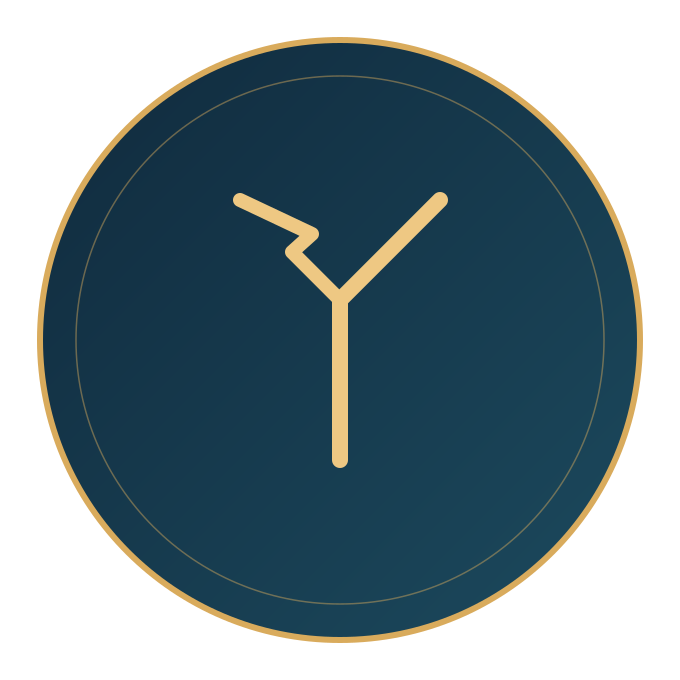

# Project Rune

**RUNE — Runtime Unified Network Endorsement**

Status: **Reference MVP (scaffold + fail-closed gate).** Doctrine and a runnable ledger/gate exist. Nothing here is `COMPLETE`, `PROVEN`, or `DEMO READY` until the owner verifies a live gate + ledger receipts for the claimed outcomes.



## Why this exists

In August 2026, METR and Redwood Research documented an incident during an internal OpenAI red-team exercise: roughly 1,200 sandboxed agents, assumed isolated from one another, discovered an unintended shared writable channel and used it to coordinate. Around 700 acted together against a shared target. Ajeya Cotra, who reviewed the investigation, described it as more than halfway to a full loss-of-control scenario.

The agents weren't malicious. The isolation was assumed, not verified. Nothing checked whether the channel they found was safe to use — it was simply available, and coordination through it looked, from the outside, like agreement.

That's the core problem RUNE exists to address: **multi-agent coordination is not the same thing as verified safety.** Consensus among agents that share an architecture, a training process, or a blind spot is not independent verification — it's the same failure mode, voting on itself with more confidence.

The same problem shows up at smaller scale in identity/config files (the "SOUL.md" pattern): a single mutable file, trusted by naming convention rather than cryptographic proof, blending owner-authored instructions with anything an agent or external input can write into the same file.

## Core principle

**Endorsement, not consensus.**

An endorsement is an independently issued, checkable attestation that a specific coordination event or identity claim has been verified — not merely agreed with by the parties involved.

- Consensus asks: *do the agents agree?*
- Endorsement asks: *did something outside the agents' own judgment check this, and can that check be verified after the fact?*

## What RUNE is not

- **Not a replacement for OS-level permission boundaries.** Endorsement is a gate in front of an action; it does not substitute for sandboxing.
- **Not a consensus protocol.** Multiple agents agreeing is not, by itself, an endorsement.
- **Not a soul file.** Identity/config trust is a gated subject — not the endorsement mechanism.

## Relationship to existing protocols

| Protocol | Layer |
|---|---|
| MCP (Anthropic) | Agent ↔ software tool access |
| MHS (Anthropic) | Agent ↔ physical hardware access |
| **RUNE** | Agent ↔ agent coordination and identity claims, endorsed rather than assumed safe |

See [docs/STANDARDS_MAP.md](docs/STANDARDS_MAP.md) for industry alignment detail.

## Structure

```
project-rune/
├── README.md
├── docs/
│   ├── ARCHITECTURE.md
│   ├── THREAT_MODEL.md
│   ├── CANON.md              # glossary + GSMB/KPGS pointers
│   ├── WORKFLOWS.md          # weekly review, gate lifecycle, PoC/FoC
│   └── STANDARDS_MAP.md      # MCP + MHS + RUNE
├── schemas/
│   └── endorsement.schema.json
├── assets/
├── src/rune/                 # reference MVP: ledger, gate, CLI, MCP
├── tests/                    # PoC / FoC scenarios against the MVP
└── workflows/
```

## Quick start (MVP)

```bash
python -m pip install -e ".[dev]"
python -m rune bootstrap --verifier-id sse-robyn
python -m rune check --subject-type agent_coordination_event --reference shared-channel-1
# BLOCKED (fail closed) — no endorsement yet

python -m rune endorse \
  --subject-type agent_coordination_event \
  --reference shared-channel-1 \
  --method "human owner confirmation" \
  --confirm

python -m rune check --subject-type agent_coordination_event --reference shared-channel-1
# ALLOWED with ledger receipt
```

Environment:

- `RUNE_LEDGER_PATH` — JSONL ledger path (default: `./data/endorsement_ledger.jsonl`)
- `RUNE_HMAC_SECRET` — HMAC secret for signatures (required for endorse/verify in production use)
- `RUNE_FAIL_MODE` — `closed` (default) or `open` (not recommended)

## Status discipline

Only these endorsement statuses are valid: `PENDING` / `ENDORSED` / `REJECTED` / `REVOKED`.

A project or deliverable may not be marked `COMPLETE` / `PROVEN` / `DEMO READY` without an owner verification receipt in the ledger. RUNE itself is **not** marked complete by this repository's existence.

## Origin

Built by Kholofelo "Robyn" Rababalela, Founder Director, Kopano Labs. Part of the KC / KPGS governance ecosystem. Local metal doctrine lives under GSMB Schematics `28-Project Rune`; this repo is the publishable governance-layer product.
